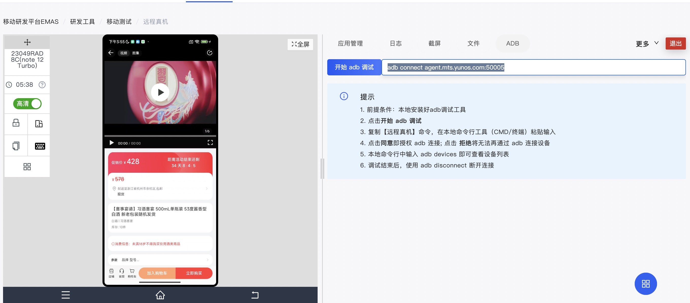
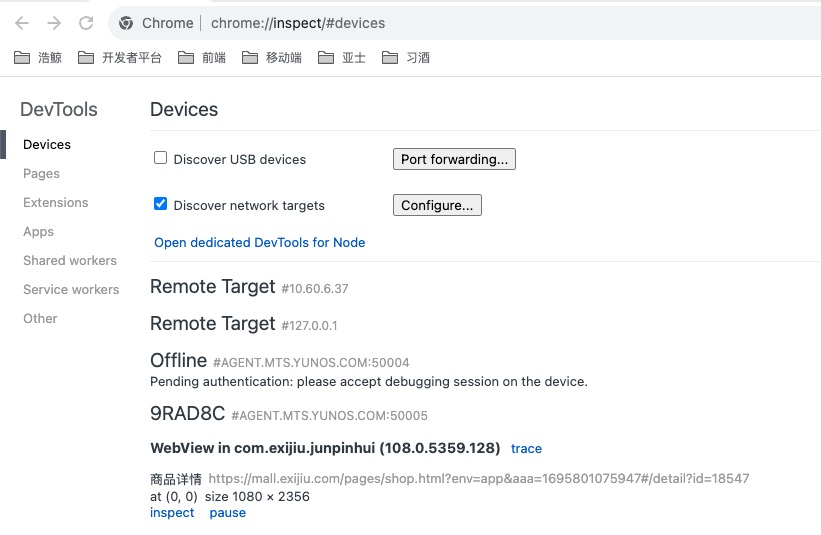
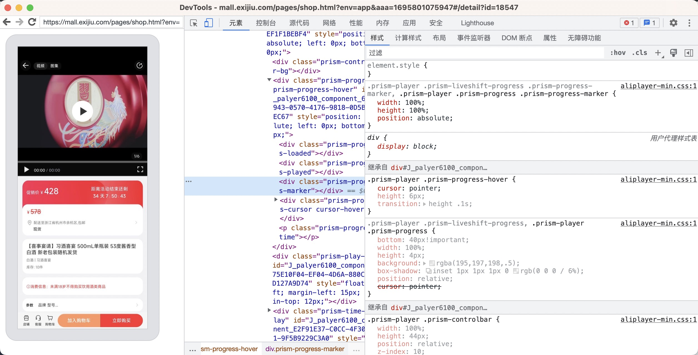
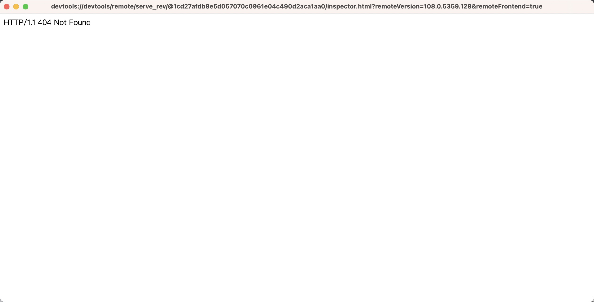

# Android远程调试

## 远程调试apk

1.  打开阿里云云真机，获取远程连接命令&#x20;

    <figure><figcaption></figcaption></figure>
2. 终端输入命令 `adb connect agent.mts.yunos.com:50005`

## [远程调试WebView](https://developer.chrome.com/docs/devtools/remote-debugging/webviews/#configure\_webviews\_for\_debugging)

使用 Chrome 开发者工具调试本机 Android 应用中的 WebView。

在 Android 4.4 (KitKat) 或更高版本上，使用 DevTools 调试本机 Android 应用程序中的 WebView 内容。

* 在您的本机 Android 应用程序中启用 WebView 调试；在 Chrome DevTools 中调试 WebView。
* 通过`chrome://inspect`访问启用调试的 WebView 列表。
* 调试WebView与通过远程调试来调试网页是一样的。

### 配置 WebView 进行调试

必须从应用程序内启用 WebView 调试。要启用 WebView 调试，请在 WebView 类上调用静态方法setWebContentsDebuggingEnabled 。 如下： \`WebView.setWebContentsDebuggingEnabled(true);

### 在 DevTools 中打开 WebView

1. `chrome://inspect` 页面显示设备上启用调试的 WebView 列表。
2. 要开始调试，请单击要调试的 WebView 下方的“inspect” 。像使用远程浏览器选项卡一样使用 DevTools。&#x20;

<figure><figcaption></figcaption></figure>

3. 即可打开DevTools&#x20;

<figure><figcaption></figcaption></figure>

4. 若如下图打不开，则需翻墙&#x20;

<figure><figcaption></figcaption></figure>
