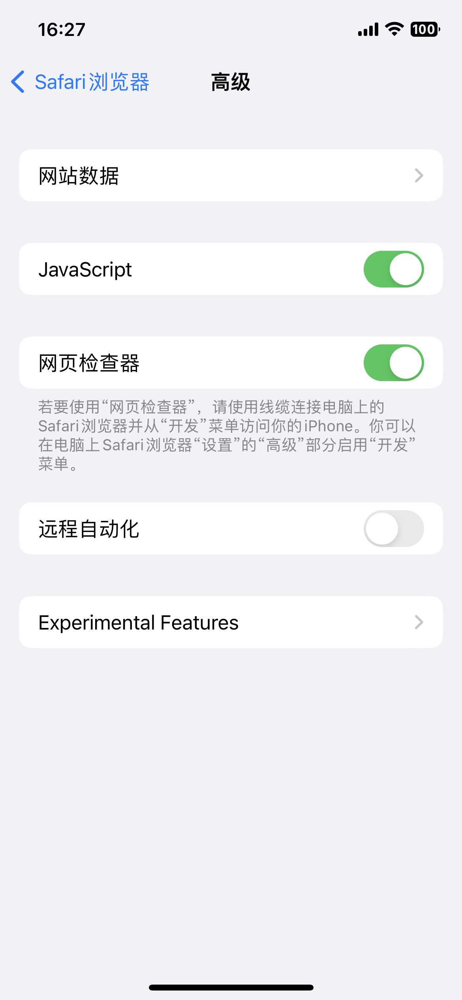
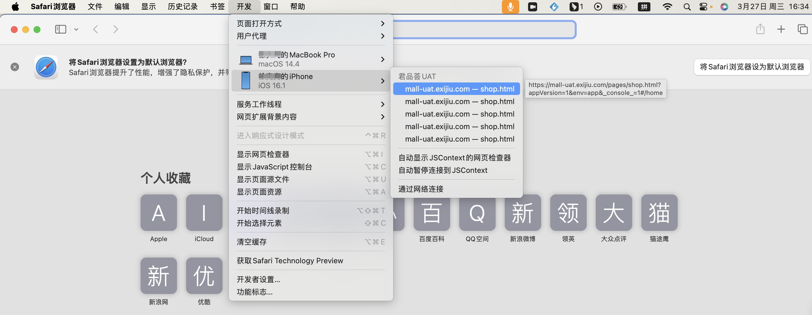
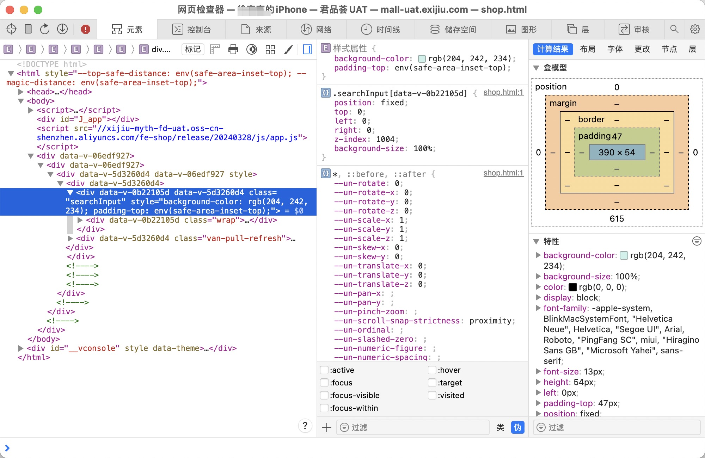

# iOS远程调试

需要一台_<mark style="color:red;">**Mac**</mark>_

1. 在iPhone中设置safari，开启`网页检查器`

<figure><figcaption></figcaption></figure>

2. USB线或Wi-FI连上Mac，然后打开Mac中的safari，点开开发者工具，就可以看到你的移动设备，然后可以调试其中的网页和webview

<figure><figcaption></figcaption></figure>

<figure><figcaption></figcaption></figure>
