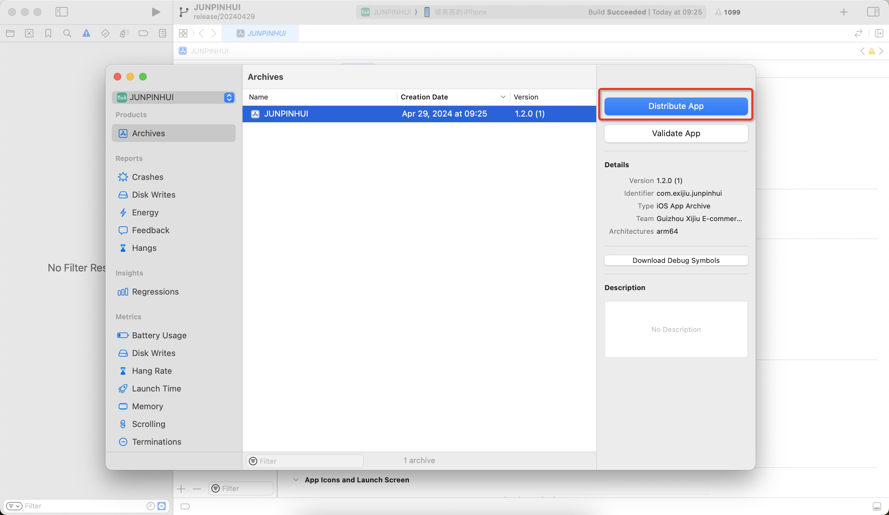
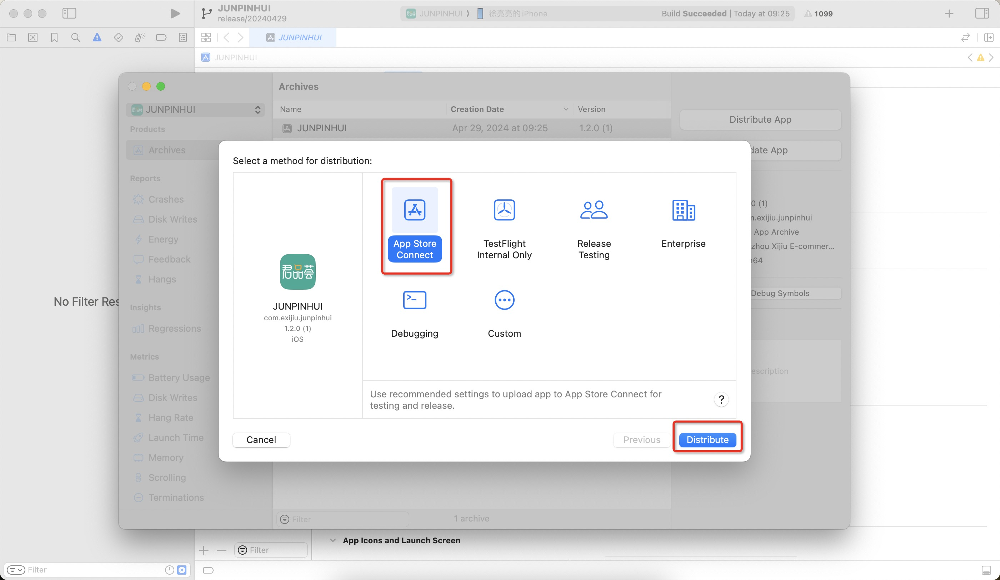
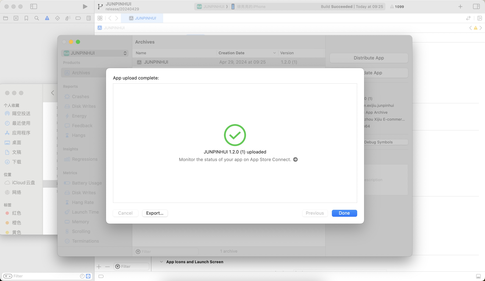
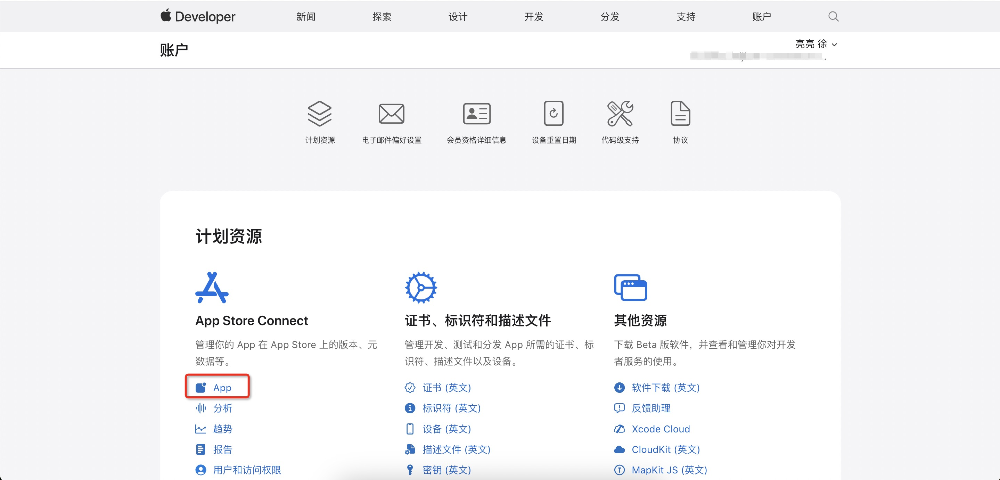
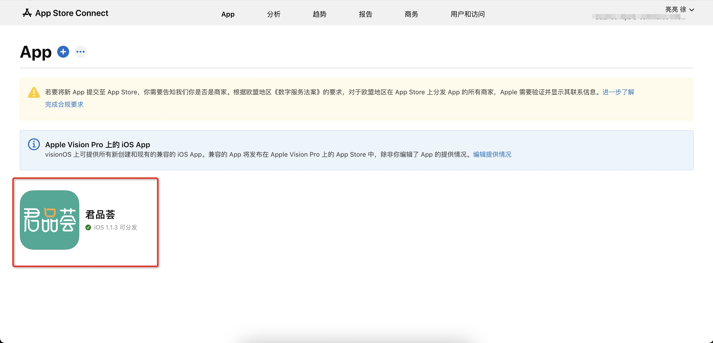
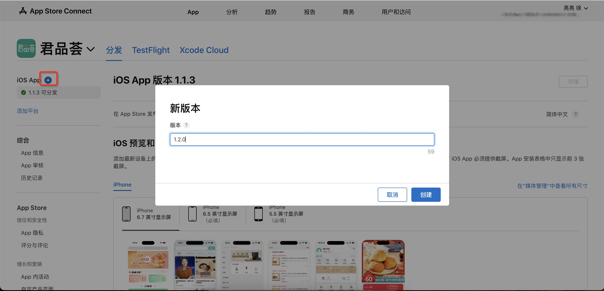
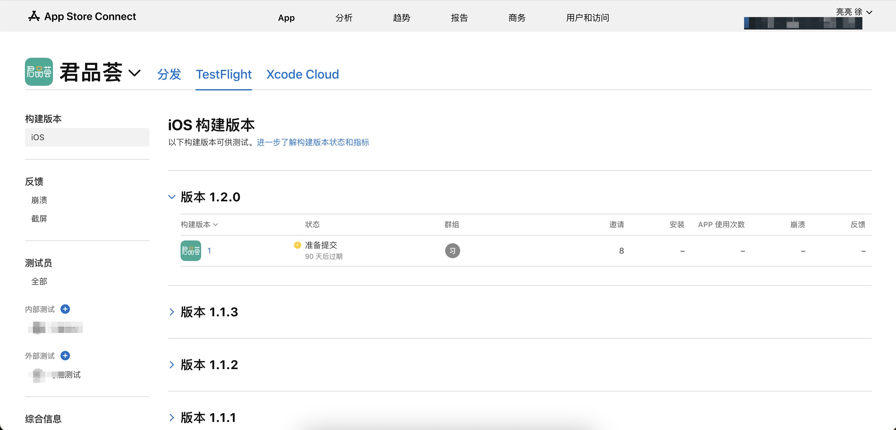
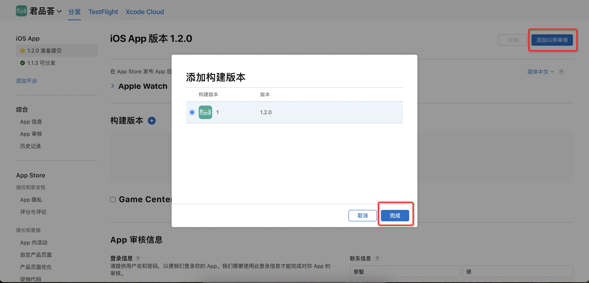

# iOS 发布应用

## 一、XCode 安装包上传

1. 打开 XCode，修改版本号
2. 点击菜单栏 Product -> Archive
   
3. 打包完成，点击 Distribute App
   
4. 选择 App Store Connect，点击下一步
   
5. 上传完成后等待一段时间即可在 AppStoreConnect 中看到上传的版本。
   

## 二、AppStoreConnect

1. 打开 https://developer.apple.com/account 网址，并登录开发者账号。
   
2. 点击 APP
   
3. 选择将要发布的 APP
   
4. 点击 testflight，可以看到刚刚上传的包，之后即可准备提交审核。
   
5. 点击加号创建一个新版本，和打包时的版本号一致，在构建版本里选择一个之前上传的版本
   
6. 如有其他信息需要修改，改完之后点存储，再点添加以供审核。
