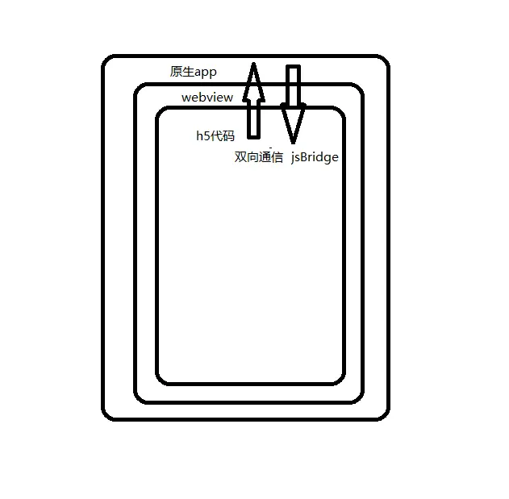

# Hybird

## 简介

Hybrid App（混合模式移动应用），是一种介于 WebApp 和原生 App 之间的，具备两者优点的混合开发 App,j 将 WebApp 套在一个原生 App 壳子之中，由原生 App 壳子提供一些 WebApp 没有的能力(调用照相机等原生能力)的一种 App 开发模式，混合开发。

## hybird 开发的优缺点

| WebApp                                                 | HybirdApp                                               | 原生 APP                         |
| :----------------------------------------------------- | :------------------------------------------------------ | :------------------------------- |
| 优点：开发成本低，能够跨平台，不需要下载，更新快       | 良好用户交互体验和 Web App 跨平台开发的优势，可以热更新 | 用户体验好，性能稳定，响应速度快 |
| 缺点：无法获取系统级别的通知，体验较差，没有固定的入口 | 交互体验和性能没有原生 APP 好                           | 不能跨平台，不能热更新，         |

## hybird 通信方式 - JSBridge

hybird 是 h5 代码套一个 app 的壳子，app 壳子提供了 h5 原生 app 的‘能力’，这样就会涉及到 h5 和 app 壳子的通信了



JSBridge 是 js 和 native 双向通信的桥梁
JSBridge 的通信原理

1. JavaScript 调用 Native 的方式
   主要有两种：注入 API 和 拦截 URL SCHEME

注入 API ：通过 webview 向 js 的 window 注入对象和方法，当 js 调用该方法时，会执行相应的原生代码

拦截 URL SCHEME：native 是 h5 的宿主，可以监听拦截请求，当我们通过 iframe.src 发送请求后会被 native 拦截并解析 url，按照指定的规则调用对应的方法

2. Native 调用 JavaScript 的方式
   将 js 方法挂载到 window 上，native 就可以调用该方法，挂载的方法可以看做是一个回调，native 会回传一些参数，这样就达到 native 向 js 传递数据了

## JSBridge 实现

### Android

#### js 调用 java

1. 创建一个类，该类是提供给 Javascript 调用。

```java
public class JSClass {

   @JavascriptInterface
   public void makePhoneCall(String phone) {
      // todo 拨打电话
   }

   @JavascriptInterface
   public String getStatusHeight() {
      // todo 获取状态栏高度
      return "25px";
   }
}
```

2. 在 webview 中添加 js 接口

```java
// 第二个参数为js接口名称
webView.addJavascriptInterface(new JSClass(), "android");
```

3. 在 js 中调用

```js
function getStatusHeight() {
  // 拨打电话
  window.android.makePhoneCall();
  // 调用java方法获取状态栏高度
  const height = window.android.getStatusHeight();
}
```

#### java 调用 js

调用 WebView.loadUrl()去执行一个预先定义好的 Javascript 方法

```js
// 将刷新页面的方法挂载到window上
window.refreshPage = (route) => {
  // todo 刷新页面
};
```

```java
webView.loadUrl("javascript:refreshPage('shopcart')")
```

#### 其他适配
如文件上传、下载等，详见 [Android WebView](./android.md)
### iOS

## 调试方式

见 [调试文档](src/hybird/README.md)

## H5 在 WebView 的适配

见 [FAQ](src/hybird/faq/README.md)
