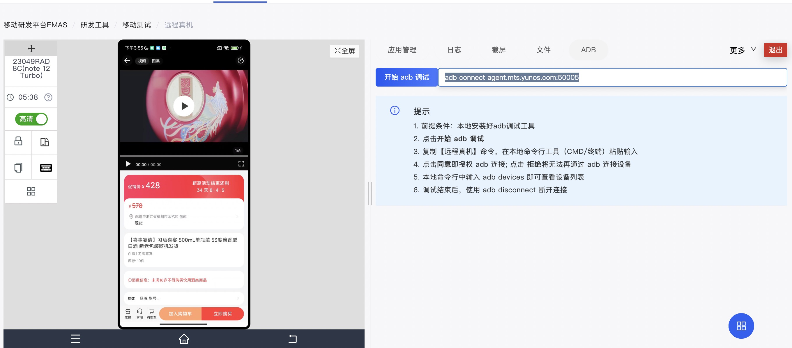
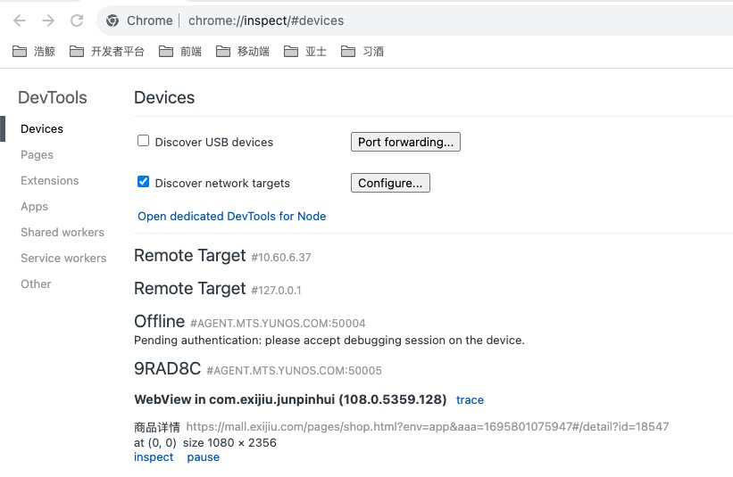
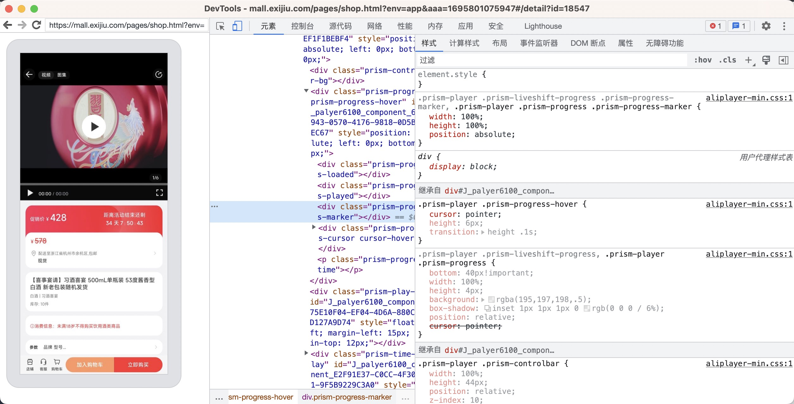
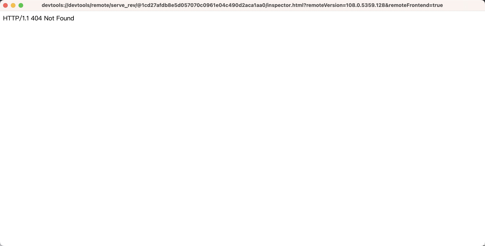

# Android 调试 H5

## 远程调试 apk

1. 打开云真机，获取远程连接命令

   

2. 终端输入命令

```bash
adb connect agent.mts.yunos.com:50005
```

## [远程调试 WebView](https://developer.chrome.com/docs/devtools/remote-debugging/webviews/#configure_webviews_for_debugging)

使用 Chrome 开发者工具调试本机 Android 应用中的 WebView。

在 Android 4.4 (KitKat) 或更高版本上，使用 DevTools 调试本机 Android 应用程序中的 WebView 内容。

- 在您的本机 Android 应用程序中启用 WebView 调试；在 Chrome DevTools 中调试 WebView。
- 通过 `chrome://inspect` 访问启用调试的 WebView 列表。
- 调试 WebView 与通过远程调试来调试网页是一样的。

#### 配置 WebView 进行调试

必须从应用程序内启用 WebView 调试。要启用 WebView 调试，请在 WebView 类上调用静态方法 setWebContentsDebuggingEnabled 。
如下：

```java
WebView.setWebContentsDebuggingEnabled(true);
```

#### 在 DevTools 中打开 WebView

1. `chrome://inspect` 页面显示设备上启用调试的 WebView 列表。
2. 要开始调试，请单击要调试的 WebView 下方的“inspect” 。像使用远程浏览器选项卡一样使用 DevTools。

   

3. 即可打开 DevTools

   

4. 若如下图打不开，则需<span style="color:green">科学上网<span>

   
