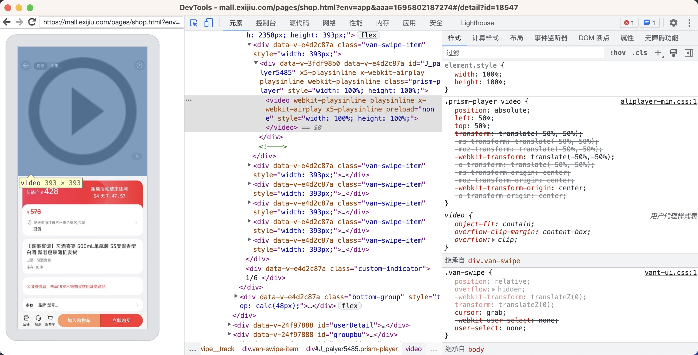
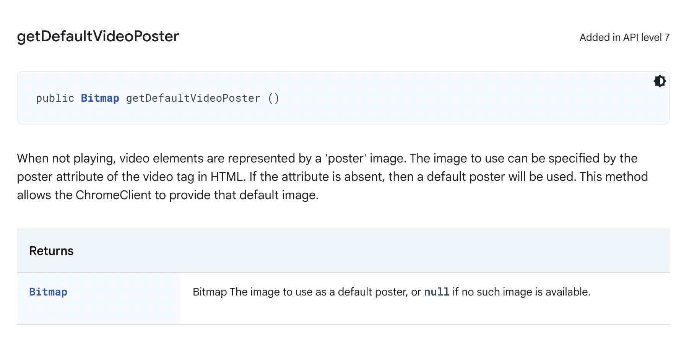
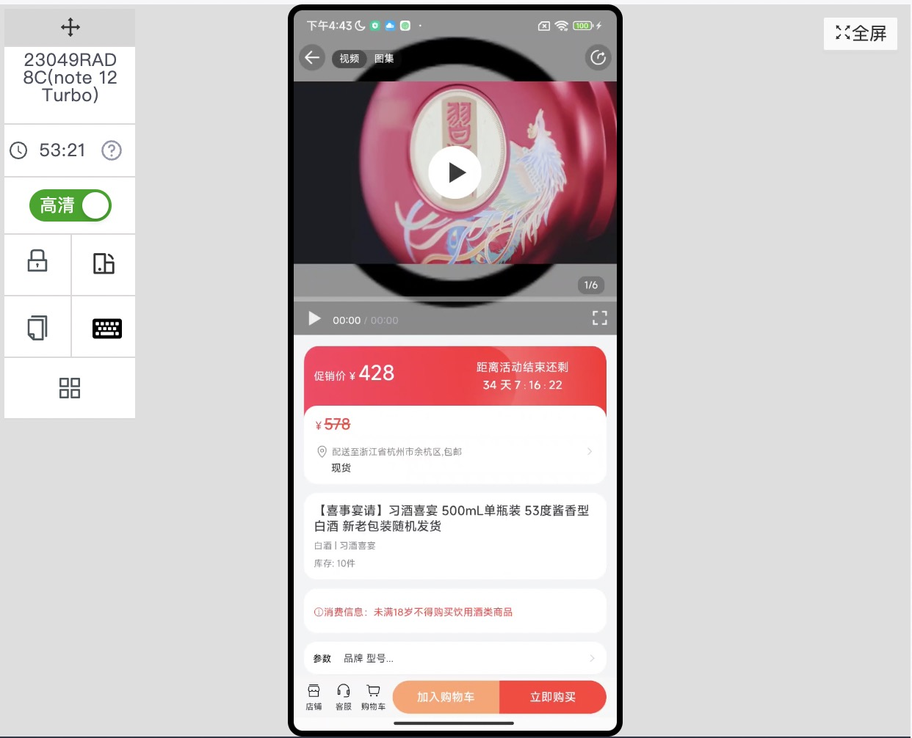
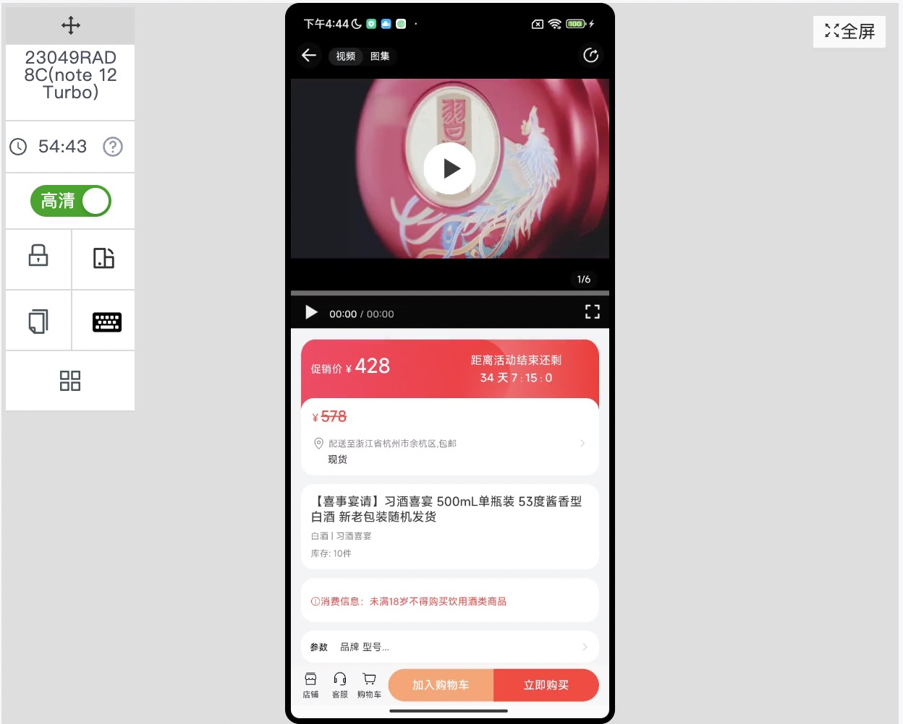

# video 标签兼容性

## video 标签在小米手机的 WebView 中出现奇怪的 “播放按钮”

经排查发现是 video 标签内的问题。



此问题仅在 Android 端部分机器会出现，在 iOS 无此问题，H5 和小程序也不会出现。

莫名其妙多了一张类似 “播放按钮” 的图片浮在 video 之上，只有当 video 初次加载时会出现，播放过一次后便会消失，这是怎么一回事？

查阅资料后，才明白这是 Android WebView 的默认行为，其根本原因是 `<video>`没有设置 poster 属性，所以自作聪明的 Android WebView 给它加了默认 poster（海报、封面）。

### 解决方式

#### 一、Native（客户端）视角

##### 重写 WebChromeClient 的 getDefaultVideoPoster() 方法

[getDefaultVideoPoster()](https://developer.android.com/reference/android/webkit/WebChromeClient#getDefaultVideoPoster%28%29)



When not playing, video elements are represented by a 'poster' image. The image to use can be specified by the poster attribute of the video tag in HTML. If the attribute is absent, then a default poster will be used. This method allows the ChromeClient to provide that default image.

不播放时，视频元素由“海报”图像表示。可以通过 HTML 中视频标签的海报属性来指定要使用的图像。如果该属性不存在，则将使用默认海报。此方法允许 ChromeClient 提供该默认图像。

```Java
@Nullable
@Override
public Bitmap getDefaultVideoPoster() {
    return Bitmap.createBitmap(10, 10, Bitmap.Config.ARGB_8888);
}
```

修改前显示



修改后显示



通过修改原生代码，从根源上解决了这个问题。

#### 二、前端（H5）视角

为 video 添加 poster 属性

[poster](https://developer.mozilla.org/en-US/docs/Web/HTML/Element/video#attr-poster)

A URL for an image to be shown while the video is downloading. If this attribute isn't specified, nothing is displayed until the first frame is available, then the first frame is shown as the poster frame.

下载视频时显示的图像的 URL。如果未指定此属性，则在第一帧可用之前不会显示任何内容，然后第一帧将显示为海报帧。

```html
<!-- Simple video example -->
<!-- 'Big Buck Bunny' licensed under CC 3.0 by the Blender foundation. Hosted by archive.org -->
<!-- Poster from peach.blender.org -->
<video
  controls
  src="https://archive.org/download/BigBuckBunny_124/Content/big_buck_bunny_720p_surround.mp4"
  poster="https://peach.blender.org/wp-content/uploads/title_anouncement.jpg?x11217"
  width="620"
>
  Sorry, your browser doesn't support embedded videos, but don't worry, you can
  <a href="https://archive.org/details/BigBuckBunny_124">download it</a>
  and watch it with your favorite video player!
</video>
```

在视频开始播放之前，属性中提供的图像 poster 将显示在其位置。如果浏览器不支持视频播放，则会显示后备文本。
