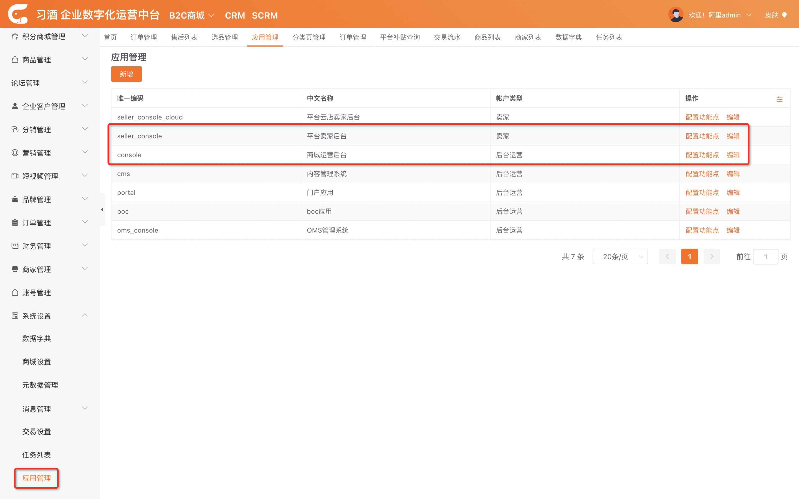
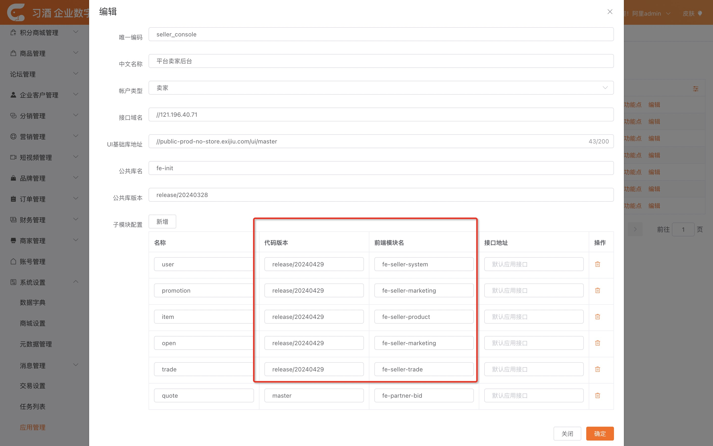
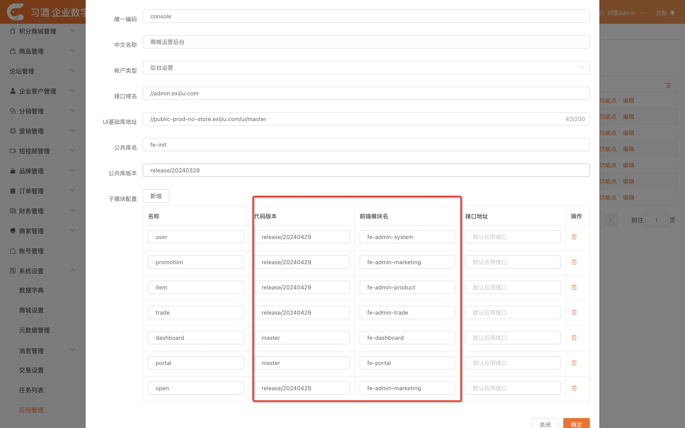
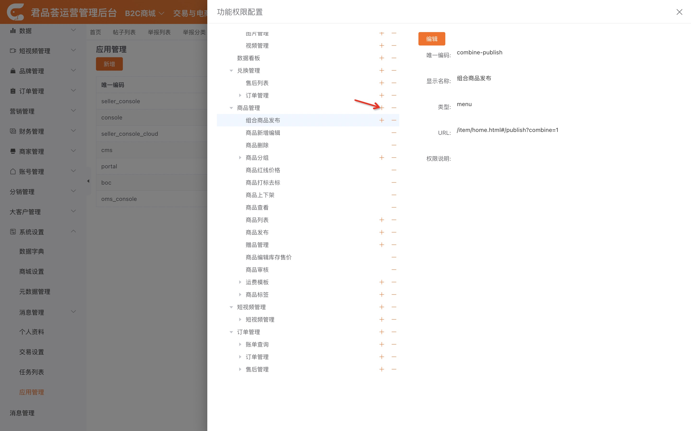
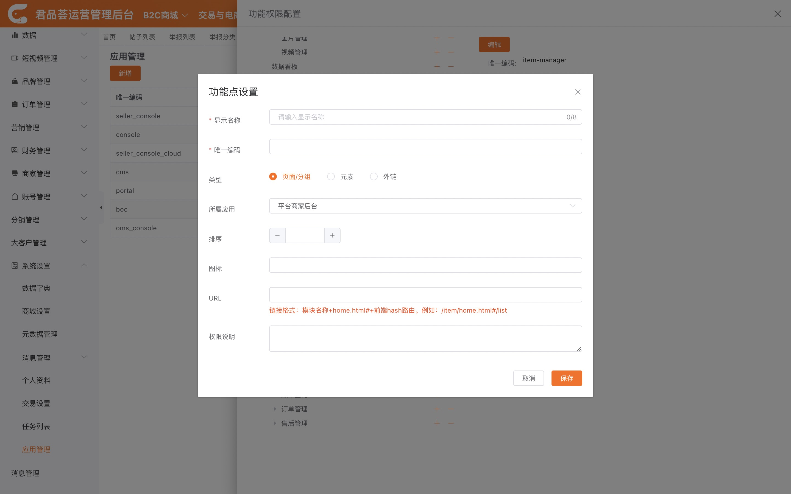
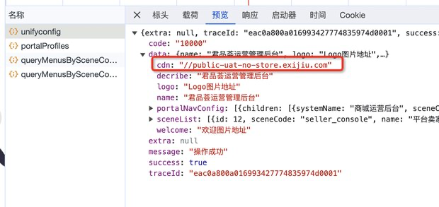

# 管理端 发布
管理端分为运营后台和商家后台

**运营后台** 主要由 fd-admin-marketing、fd-admin-product、fd-admin-system、fd-admin-trade组成。<br/>
**商家后台** 主要由 fd-seller-marketing、fd-seller-product、fd-seller-system、fd-seller-trade组成。<br/>
引用了init 工程，这 9 个应用发布流程一样。

除此之外还引用了 ui 库，是 gmall 核心库，发布方式见 [核心库发布](./core.md)
## 运行流水线

见 [大禹发布流程](./dayu.md)

## 配置
1. 登录[运营管理后台](https://admin.exijiu.com/login/index.html)
2. 点击左侧导航栏的`系统管理-应用管理`
   
3. 点击设置按钮，修改分支

    - console 对应 admin 工程
    - seller_console 对应 seller 工程

   

   

4. 点击配置功能点，配置菜单。

   

   

### FAQ
1. portal配置在sae，生产在mse。`acm.portal.unifyconfig`
   ```json
   {
	"name": "习酒 企业数字化运营中台",
	"decribe": "为了无法计算的价值，上云就上阿里云！",
	"logo": "Logo图片地址",
	"welcome": "欢迎图片地址",
	"cdn": "//public-prod-no-store.exijiu.com",
	"portalNavConfig": [
         {
            "rootName": "交易与电商",
            "isDrop": true,
            "children": [
               {
                  "displayName": "B2C商城",
                  "systemName": "商城运营后台",
                  "sceneCode": "console"
               }
            ]
         },
         {
            "rootName": "营销与客户",
            "isDrop": true,
            "children": [
               {
                  "displayName": "内容营销",
                  "systemName": "内容管理系统",
                  "sceneCode": "cms"
               }
            ]
         },
         {
            "rootName": "CRM",
            "isDrop": false,
            "url": "https://portal.exijiu.com/crm/#/",
            "children": []
         }
      ]
   }
   ```
   - 资源文件访问地址通过下面的接口获取
   https://portal-uat.exijiu.com/portal/api/unifyconfig
      
   - 顶部菜单配置在portalNavConfig，参照示例即可


