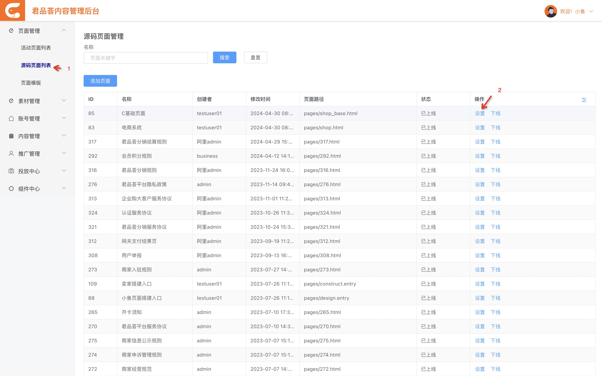

# h5 发布

h5 主要由 shop、 shop-base 和 init 工程 3 个应用组成，这 3 个应用发布流程一样。

除此之外还引用了 ui 库，是 gmall 核心库，发布方式见 [核心库发布](./core.md)

## 运行流水线

见 [大禹发布流程](./dayu.md)

## 配置

1. 登录[内容管理后台](https://myth.exijiu.com/login/index.html)
2. 点击左侧导航栏的`源码页面`
   
3. 点击设置按钮，修改分支

    - pages/shop_base.html 对应 shop_base 工程
    - pages/shop.html 对应 shop 工程

### 示例
以 shop_base 工程 发布分支 `release/20240429` 为例，修改如下：

1. 下面脚本中 value 需改为 release/20240429

    ```JavaScript
    <script src="${fdDomain}/ui/master/my.wap.js" value="release/20240429"></script>
    ```

2. 下面脚本中 name fe-shop-base 的 branch 需改为 release/20240429

    ```JavaScript
    <script>
        var _apps_ = {
        '/pages/shop.html': { name: 'fe-shop', branch: 'release/20240430' },
        '/pages/shop_base.html': { name: 'fe-shop-base', branch: 'release/20240429' },
        };
    </script>

    ```

3. 下面脚本中 branch 需改为 release/20240429

    ```JavaScript
    <script src="${fdDomain}/fe-shop-base/release/20240429/js/app.js"></script>
    ```

4. 通常 init 不会改动，发布 master 即可。

    ```JavaScript
    <script src="${fdDomain}/fe-init/master/js/wap.js"></script>
    ```

    若 init 工程 wap 目录下有改动，则下面脚本中分支需改为 init 工程发布分支,如`release/20240429`

    ```JavaScript
    <script src="${fdDomain}/fe-init/release/20240429/js/wap.js"></script>
    ```

5. 通常 ui 不会改动，发布 master 即可。

    ```JavaScript
    <script src="${fdDomain}/ui/master/my.wap.js" value="release/20240429"></script>
    ```

    若 ui 工程 wap 目录下有改动，则下面脚本中分支需改为 ui 发布分支 `release/20240428`

    ```JavaScript
    <script src="${fdDomain}/ui/release/20240428/my.wap.js" value="release/20240429"></script>
    ```
